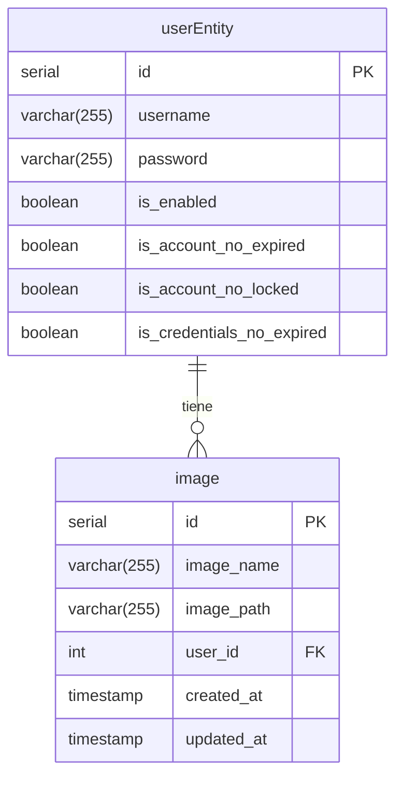

# Procesador de imágenes

## Descripción

El procesador de imágenes es un servicio que recibe una imagen y la procesa, devolviendo un resultado.

## Requisitos

- Java 21
- Maven
- Docker

## Proceso de construcción
Los requerimientos del proyecto y su idea se encuentran en [roadmap](https://roadmap.sh/projects/image-processing-service)
### 1. Iniciarlizar el proyecto.
Se creo el proyecto con la herramienta de creación de proyectos de Spring Boot.
[Aquí](https://start.spring.io/#!type=maven-project&language=java&platformVersion=3.3.4&packaging=jar&jvmVersion=21&groupId=roadmap.backend&artifactId=image-processing-service&name=image-processing-service&description=Este%20proyecto%20implica%20crear%20un%20sistema%20de%20backend%20para%20un%20servicio%20de%20procesamiento%20de%20im%C3%A1genes%20similar%20a%20Cloudinary&packageName=roadmap.backend.image-processing-service&dependencies=web,devtools,lombok,docker-compose,security,modulith,data-jdbc,postgresql)
#### Dependiencias
* [Lombok](https://projectlombok.org/)
* [Spring Web](https://docs.spring.io/spring-boot/docs/3.3.4/reference/htmlsingle/index.html#web)
* [Spring Boot DevTools](https://docs.spring.io/spring-boot/docs/3.3.4/reference/htmlsingle/index.html#using.devtools)
* [Spring Docker Compose](https://spring.io/blog/2023/06/21/docker-compose-support-in-spring-boot-3-1)
* [Spring Security](https://docs.spring.io/spring-boot/docs/3.3.4/reference/htmlsingle/index.html#web.security)
* [Spring Modulith](https://docs.spring.io/spring-modulith/reference/)
* [Spring Data JDBC](https://docs.spring.io/spring-boot/docs/3.3.4/reference/htmlsingle/index.html#data.sql.jdbc)
* [Spring for Apache Kafka](https://docs.spring.io/spring-boot/docs/3.3.4/reference/htmlsingle/index.html#messaging.kafka)
### 2. Docker compose
Se configuraron los servicios de Docker compose para que se ejecuten en el entorno de desarrollo.
#### Servicios
* PostgreSQL
* Kafka
* Zookeeper

### 3. Esquema de la base de datos
La base de datos se genera automaticamente con el despliegue del proyecto, pues asi
esta definido en  `application.properties` la propiedad `spring.sql.init.mode=always`

### 4. Conectar la base de datos
La conexión a la base de datos se realiza mediante el uso de un datasource. Este datasource se configura en el archivo `application.properties`
Se usan dependencias de Spring para la conexión a la base de datos.
- [Spring Data JDBC](https://docs.spring.io/spring-boot/docs/3.3.4/reference/html/boot-features-sql.html)
- [Driver PostgreSQL](https://jdbc.postgresql.org/)
### 5. Spring Security
Se configuraron los servicios de Spring Security para que se ejecuten en el entorno de desarrollo.
---
 **Aqui voy...**
---
### 6. Controladores Auth

### 7. Servicios de Kafka

### 8. Procesador de imágenes